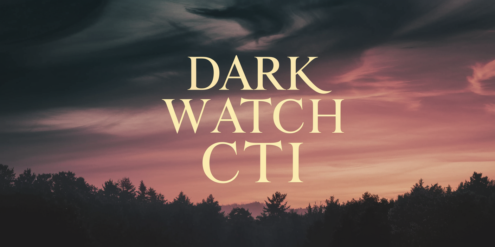

# DarkWatchCTI

## Overview
DarkWatchCTI is a collection of Cyber Threat Intelligence (CTI) gathered from the clearnet, deep web, and dark web. This repository provides a structured reference for security professionals, researchers, journalists, and anyone interested in understanding the cyber threat landscape. 

While primarily intended for cybersecurity professionals, this repository may also be useful to academics, investigative journalists, and others who need insight into dark web activities.

## Contents
- **Darknet Markets** – Lists of active and inactive darknet markets.
- **Fraud Shops** – Various illicit shops providing financial fraud services.
- **Search Engines & Index Directories** – Dark web search engines and indexes.
- **Vendor Shops** – Individual vendor pages operating on darknet markets.
- **Stressers & Booters** – DDoS-for-hire services.
- **Hosting Services** – Anonymous hosting providers.
- **Communication Services** – Secure email, messaging, and chat services.
- **Security Tools** – OpSec guides, security tools, and anonymization services.
- **Cryptocurrency Services** – Mixers, exchanges, and escrow platforms.
- **Ransomware Groups** – Public leak sites and ransomware gang pages.
- **Discord & Twitter** – Accounts and servers related to cybercriminal activities.
- **Cyber Threat Intelligence Services** – Legal services that have proven to be reliable in some form of cybersecurity.
- **Everything Else** – Miscellaneous darknet services and sites.
- **New Darknet Markets** - New Darknet Markets that have a recent start on the Dark Web.

## Data Sources
The information in this repository is aggregated from:
- Open-source intelligence (OSINT)
- Deep and dark web monitoring
- Independent cybersecurity research
- User-submitted reports

## Status Monitoring
[Dark Web Informer Status Page](https://status.darkwebinformer.com/status/darkwebinformer) monitors all sites that are on the Dark Web Informer platform and GitHub in real-time.

- Status page refreshes every **5 minutes**.
- Shows the last **45 minutes to 1 hour** of data (except for the website, which is **30 minutes to 1 hour**).
- Newly added sites appear at the **bottom of the page**; if a site isn't listed alphabetically, check the bottom.
- The page is **reorganized periodically** to maintain proper order, but changes may occur at any time.

## Usage Disclaimer
This repository is for informational and research purposes only. The inclusion of any market, service, or forum does not constitute an endorsement or promotion of illegal activities. Users should exercise caution, follow applicable laws, and understand the risks associated with accessing darknet resources. 

Use this information responsibly and within the confines of your jurisdiction. This repository is meant to enhance awareness and provide intelligence for lawful investigations, cybersecurity research, and threat intelligence operations.

## Contributing
If you would like to contribute to this repository, please send relevant information through a direct message on a social media platform. If you wish to be credited, provide your GitHub username or another social media account. Otherwise, contributions will be considered anonymous. 

We do not accept pull requests or open issues on this repository to maintain operational security.

## Contact
For more Cyber Threat Intelligence, visit [Dark Web Informer](https://darkwebinformer.com).

## Donations
If you find this resource valuable and would like to support further research, donations can be made at [darkwebinformer.com/donations](https://darkwebinformer.com/donations).

## Contributors
- **Dark Web Informer** - [Dark Web Informer](https://darkwebinformer.com)
